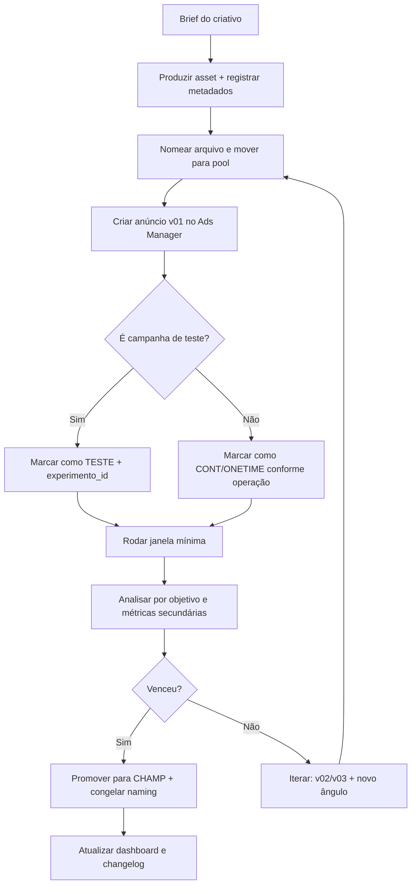

# Estrutura ideal de criativos, campanhas e conjuntos no Meta Ads segundo o método Subido

## Resumo executivo

A “forma ideal” de organizar campanhas no Meta Ads, no método do Pedro Sobral (Subido), parte de três ideias centrais: **(a)** entender e respeitar a estrutura **campanha → conjunto de anúncios → anúncio** (as “três caixas”); **(b)** manter a conta **organizável e filtrável** (especialmente para separar *testes*, *conteúdo/distribuição*, *lançamentos* e *campanhas contínuas*); e **(c)** operar com **pouca fragmentação**, priorizando clareza e capacidade de análise. citeturn2view1turn2view2turn2view0  

Ele não publica, em fontes abertas do blog, um “manual definitivo” de nomenclatura para Meta Ads com todos os campos do seu pedido (ex.: idioma/região, experimento_id, versionamento por v1/v2 etc.). O que existe publicamente são: (1) a defesa explícita da **nomenclatura como requisito de profissionalismo**; (2) exemplos de **estrutura e organização de públicos** (incluindo numeração e janelas de aquecimento); e (3) exemplos de **tagging em nomenclaturas** (especialmente em públicos) usando colchetes como padrão visual. citeturn2view0turn2view2turn11view4  

Este relatório, portanto, separa com rigor:  
- **O que é explicitamente defendido pelo Sobral** (com fonte);  
- **A implementação operacional recomendada** para atender aos objetivos dele (clareza+filtros+escala), marcada como **DERIVAÇÃO OPERACIONAL** quando não houver afirmação direta publicada. citeturn2view0turn11view5turn11view4  

## Princípios do Subido para estruturar campanhas e conjuntos

### A hierarquia das “três caixas” como base de organização

Sobral descreve que, para um anúncio chegar às pessoas certas, você configura três “caixas”: **campanha, conjunto de anúncios e anúncio**, e que entender a estrutura é o “passo número um” para testar e otimizar corretamente. citeturn2view1  

No mesmo material, ele organiza o que “vive” em cada nível (ex.: na campanha entram objetivo, manual vs Advantage, CBO/ABO, orçamento; no conjunto entram pixel/evento; no anúncio entram criativos/textos), o que é crucial para definir o que deve virar **campo de nomenclatura** (porque facilita auditoria e filtros). citeturn2view1  

### Três tipos de campanhas para “90% do jogo”

Em artigo específico sobre Meta Ads, Sobral afirma que “só existem três tipos de campanha” que o gestor precisa dominar: **criação de audiência**, **captação de leads** e **geração de vendas**, e que a maior parte das estratégias é variação dessa lógica (ex.: construir audiência → transformar em leads → vender). citeturn11view2  

Na prática, isso significa que “tipo de campanha” (ex.: AUD, LEAD, SALES) é um dos campos mais úteis para **campanha-level naming**, porque vira filtro rápido para leitura de conta e para conversas com cliente. citeturn11view2turn2view0  

### Baixa fragmentação e separação por níveis de aquecimento

Nos princípios de públicos no Meta Ads, Sobral recomenda que campanhas tendem a performar melhor com **4 a 8 conjuntos** e dá exemplos de estrutura separando públicos quentes e frios (inclusive sugerindo campanhas distintas quando necessário para evitar que públicos grandes “roubem” orçamento dos públicos menores). citeturn2view2  

Isso tem impacto direto na organização “ideal”: a nomenclatura deve tornar visível **o nível de aquecimento** (quente/morno/frio) e, quando houver estratégia de exclusão/ordem, isso deve aparecer de forma legível (por exemplo via prefixos numéricos). citeturn2view2  

### Por que nomenclatura é “habilidade”, não capricho

Sobral afirma que, sem uma boa nomenclatura, você não consegue responder perguntas básicas (“o que está sendo divulgado — vídeo, e-book? estou fazendo lead?”) e que é necessário haver nomenclatura em dois lugares: **(1)** campanhas/conjuntos/anúncios e **(2)** públicos; ele também conecta isso à exigência do cliente/empresa de conseguir filtrar gastos por “testes”, “último lançamento”, “distribuição de conteúdo”. citeturn2view0  

Esse trecho é a justificativa mais direta, em fonte aberta, para usar **tags padronizadas** e nomes “filtráveis”. citeturn2view0  

## Padrão de nomenclatura “ideal” no método Subido

### O que é claramente especificado vs o que é derivação operacional

**Especificado de forma clara e pública por Sobral (com evidência):**  
- É obrigatório existir nomenclatura para permitir filtros e auditoria (inclusive por cliente). citeturn2view0  
- A conta deve permitir responder “o que está sendo anunciado” e “qual era o gasto em testes/lançamentos/conteúdo”. citeturn2view0  
- A estrutura é campanha → conjunto → anúncio; e o gestor precisa entender o que configura em cada nível. citeturn2view1  
- Ele usa **colchetes e siglas** como um padrão de nomenclatura em exemplos públicos (especialmente para públicos, com tags e janelas de tempo). citeturn11view4turn2view2  

**NÃO ESPECIFICADO (em fontes abertas do blog/LinkedIn) como regra única:**  
- Um “modelo fechado” com todos os campos obrigatórios do seu pedido (idioma/região, experimento_id etc.).  
- Um padrão publicado de versionamento (v1/v2) para criativos no Meta Ads.  
- Limite de caracteres desejado por nível. (**NÃO ESPECIFICADO**)

**DERIVAÇÃO OPERACIONAL (proposta abaixo):** um padrão que cumpre as exigências do Sobral (clareza + filtrabilidade + baixa fragmentação) e incorpora seus exemplos públicos de tagging por colchetes. citeturn2view0turn11view4  

### Campos obrigatórios e opcionais por nível

Abaixo está um padrão que atende seu pedido e é compatível com as justificativas do Sobral (identificação do que está sendo anunciado + possibilidade de filtro por tipo de campanha/teste/lançamento). citeturn2view0turn11view2  

**Campanha (obrigatório):**  
- Objetivo (ex.: SALES/LEAD/AWARE)  
- Produto/Linha  
- Estágio do funil (Topo/Meio/Fundo, ou Awareness/Consideration/Conversion)  
- Teste vs Controle vs Contínua (tag)  
- Data/versão (ISO)  
- Idioma/Região  

**Conjunto (obrigatório):**  
- Público (tipo + aquecimento + janela)  
- Estágio do funil (consistência com campanha)  
- Teste/controle (quando for célula de teste)  
- Data/versão  
- Idioma/Região  

**Anúncio (obrigatório):**  
- Criativo/ângulo (ou “tema”)  
- Identificador de variação (A/B/C ou v01/v02)  
- Formato (UGC, carrossel, estático, reels, etc.)  
- Stage/CTA (quando relevante)  
- Data/versão  
- Idioma/Região  

**Campos opcionais (todos os níveis):**  
- Canal/placement (quando faz sentido separar)  
- Oferta (ex.: cupom, condição, deadline)  
- Experimento ID (para testes sistemáticos)  

### Variantes de naming para equipes em fases diferentes

| Variante | Quando usar | Prós | Contras |
|---|---|---|---|
| Simples | Pequenas contas, poucos produtos, baixa rotatividade | Rápido de implementar; pouca fricção | Menos filtrável; difícil auditar testes/lançamentos |
| Intermediário | Agência com múltiplas campanhas ativas e testes contínuos | Bom equilíbrio: filtra por tipo/objetivo/público e mantém legibilidade | Requer disciplina e padronização mínima |
| Avançado | Operação com alto volume (muitos criativos, múltiplas regiões e experimentos) | Escala com governança; facilita automação, QA e exports | Mais longo; risco de “nome gigante” (limite de caracteres: **NÃO ESPECIFICADO**) |

O Sobral argumenta a favor do que essa tabela busca resolver: se você não consegue filtrar “gasto em testes / último lançamento / distribuição de conteúdo”, você se embanana e perde tempo — ou perde confiança do cliente. citeturn2view0  

## Templates por nível e exemplos prontos

### Regras de tags e versionamento

Esta seção é **DERIVAÇÃO OPERACIONAL** baseada na necessidade que ele descreve (filtros e clareza) e no estilo de tags com colchetes que aparece nos exemplos públicos de nomenclatura (públicos com `[ENG]`, `[WT]`, `[BA]`). citeturn2view0turn11view4  

Regras recomendadas:
- **Tags entre colchetes** para campos de filtro (ex.: `[OBJ=SALES]`, `[FUNIL=TOFU]`).  
- **Data ISO** sempre no mesmo formato: `YYYY-MM-DD` (ex.: `2026-02-11`).  
- **Versionamento**: `v01`, `v02`… (evita “final_final_agoraVai”).  
- **Sufixo de nível** para exports e auditoria humana: `|CAM`, `|AS`, `|AD` (campanha/ad set/ad).  
- **Separador padrão**: ` | ` (melhor para leitura e filtros por “contains”).  

### Templates em tabela

| Nível | Template (DERIVAÇÃO OPERACIONAL) | Exemplo preenchido | Propósito | Notas |
|---|---|---|---|---|
| Campanha | `[OBJ] [PROD] [FUNIL] [TESTE/CTRL/CONT] [CBO/ABO] [REG] [LANG] [DATA] |CAM` | `[OBJ=SALES] [PROD=CursoXYZ] [FUNIL=BOFU] [CONT] [CBO] [BR] [PT] [2026-02-11] |CAM` | Filtrar rápido por objetivo, funil e natureza (teste vs contínuo) | “CONT” e “TESTE” não são termos publicados como padrão único (NÃO ESPECIFICADO); são etiquetas úteis para o tipo de filtro que ele exige |
| Conjunto | `NN_[AUD] [HEAT] [JANELA] [FUNIL] [TESTE/CTRL] [REG] [LANG] [DATA] |AS` | `03_[AUD=VV75] [HEAT=QUENTE] [7D] [MOFU] [CTRL] [BR] [PT] [2026-02-11] |AS` | Visualizar aquecimento e janela (ponto muito presente nos exemplos dele) | A numeração e a lógica “quentes > frios” aparecem em exemplos do próprio blog citeturn2view2 |
| Anúncio | `AD_[ANGULO] [FORMATO] [VAR] [CTA] [LANG] [REG] [DATA] |AD` | `AD_[ANG=ProvaSocial] [UGC] [B] [CTA=SaibaMais] [PT] [BR] [2026-02-11] |AD` | Versionar criativos sem confundir e permitir análise por ângulo | O Sobral recomenda cadência de mudanças de criativos de ~2–3 dias enquanto otimiza, o que exige versionamento para não perder o histórico citeturn1search13 |

### Doze exemplos práticos de nomes

Os exemplos abaixo são **realistas e prontos para copiar** (não são extraídos de uma conta real pública do Sobral, o que seria incomum em fonte aberta). Eles cobrem always-on, lançamento, remarketing, catálogo, A/B, CBO vs ABO.

1) Always-on vendas (CBO)  
`[OBJ=SALES] [PROD=Loja_Essenciais] [FUNIL=BOFU] [CONT] [CBO] [BR] [PT] [2026-02-11] |CAM`

2) Always-on captação de leads (ABO)  
`[OBJ=LEAD] [PROD=Clinica_Coluna] [FUNIL=MOFU] [CONT] [ABO] [BR-AL] [PT] [2026-02-11] |CAM`

3) Construção de audiência (vídeo)  
`[OBJ=AUD] [PROD=MarcaXYZ] [FUNIL=TOFU] [CONT] [CBO] [BR] [PT] [2026-02-11] |CAM`  
(Compatível com “criação de audiência” como tipo de campanha) citeturn11view2  

4) Lançamento “convocação” (captação)  
`[OBJ=LEAD] [PROD=Imersao_2026Q1] [FUNIL=MOFU] [ONETIME] [CBO] [BR] [PT] [2026-02-11] |CAM`  
(“ONETIME” é uma etiqueta útil; termo exato como padrão do Sobral em Meta Ads: **NÃO ESPECIFICADO**)  

5) Lançamento vendas (carrinho aberto)  
`[OBJ=SALES] [PROD=Imersao_2026Q1] [FUNIL=BOFU] [ONETIME] [CBO] [BR] [PT] [2026-02-11] |CAM`

6) Remarketing quente (visitantes 7D)  
`[OBJ=SALES] [PROD=Loja_Essenciais] [FUNIL=BOFU] [RT] [ABO] [BR] [PT] [2026-02-11] |CAM`

7) Catálogo / DPA (e-commerce)  
`[OBJ=SALES] [PROD=Catalogo_Loja] [FUNIL=BOFU] [CONT] [CBO] [BR] [PT] [2026-02-11] |CAM`

8) Teste A/B criativo (campanha dedicada de teste)  
`[OBJ=SALES] [PROD=CursoXYZ] [FUNIL=MOFU] [TESTE_CR] [ABO] [BR] [PT] [2026-02-11] |CAM`  
(Separar campanha de teste pode proteger campanhas contínuas; isso conversa com a lógica de “testar com o carro andando” e com cadência de otimização) citeturn1search13turn2view0  

9) Teste público (campanha dedicada)  
`[OBJ=LEAD] [PROD=Clinica_Coluna] [FUNIL=MOFU] [TESTE_AUD] [ABO] [BR-AL] [PT] [2026-02-11] |CAM`

10) Estrutura com separação quente vs frio (duas campanhas)  
`[OBJ=SALES] [PROD=Loja_Essenciais] [FUNIL=BOFU] [HOT] [CBO] [BR] [PT] [2026-02-11] |CAM`  
`[OBJ=SALES] [PROD=Loja_Essenciais] [FUNIL=TOFU] [COLD] [CBO] [BR] [PT] [2026-02-11] |CAM`  
(A lógica de separar quentes e frios em campanhas aparece como recomendação/solução no artigo de públicos) citeturn2view2  

11) Nome de conjunto com numeração e janela (modelo inspirado em exemplo do blog)  
`00_[AUD=ENG] [HEAT=QUENTE] [7D] [MOFU] [CTRL] [BR] [PT] [2026-02-11] |AS`  
(“Envolvimento 7D” é um padrão que ele usa em exemplo de estrutura) citeturn2view2  

12) Naming de anúncio com ângulo e variação  
`AD_[ANG=Dor→Clareza] [VIDEO_30s] [v03] [CTA=SaibaMais] [PT] [BR] [2026-02-11] |AD`  
(O LinkedIn dele reforça pensar anúncios por “nível de consciência” — isso é base para o campo “ÂNGULO/ESTÁGIO”) citeturn11view1  

## Pools de criativos e organização de assets fora do Gerenciador

### Convenções para pools de criativos

Sobral recomenda uma cadência média de alterações (ex.: criativos a cada **2–3 dias**) dentro de uma rotina de otimização “com o carro andando”. Isso implica que a organização “ideal” é aquela que permite testar e iterar sem confusão de versões. citeturn1search13turn2view0  

Uma convenção prática (DERIVAÇÃO OPERACIONAL) é dividir anúncios em “pools” por função:

- **Campeão**: criativo mais estável/performance base (ex.: `POOL=CHAMP`).  
- **Variações do campeão**: alterações controladas (Hook, prova, CTA, formato) (ex.: `POOL=CHAMP_VAR`).  
- **Pool por ângulo**: grupos de criativos por tese (dor, prova social, mecanismo, comparação, objeções, autoridade).  
- **Pool por estágio**: TOFU/MOFU/BOFU alinhado ao “nível de consciência” (ele descreve isso explicitamente no LinkedIn). citeturn11view1  

### Organização de assets em drive e metadados

Sobral não publica em detalhe, em fonte aberta, um padrão de pastas/EXIF/metadados para criativos do Meta Ads (**NÃO ESPECIFICADO**). O que ele explicita é que, no onboarding, recomenda uma “call de organização” para ensinar **como organizar material no Drive** e **como nomear anúncios**. citeturn11view5  

Uma estrutura de pastas recomendada (DERIVAÇÃO OPERACIONAL), alinhada a esse onboarding:

- `/CLIENTE/01_META_ADS/`  
  - `/CAMPAIGNS/2026/2026-02/`  
  - `/CREATIVES/POOL_CHAMP/`  
  - `/CREATIVES/POOL_TEST/`  
  - `/EXPORTS/`  
  - `/REPORTS/`  
  - `/BRIEFINGS_E_APROVACAO/`

**Naming de arquivos** (DERIVAÇÃO OPERACIONAL) para facilitar rastreio cruzado com o anúncio:  
`YYYYMMDD__PROD__FUNIL__ANGULO__FORMATO__PLACEMENT__LANG-REG__vNN.ext`  
Ex.: `20260211__CursoXYZ__MOFU__ProvaSocial__UGC__Reels__PT-BR__v03.mp4`

**Metadados/EXIF (NÃO ESPECIFICADO para Sobral):** recomendado registrar ao menos em planilha-manifesto (CSV) os campos: `creative_id_interno`, `campanha`, `adset`, `ad_name`, `url`, `utm_campaign`, `utm_content`, `hook`, `oferta`, `status_aprovacao`, `dono_da_peca`, `data_publicacao`.

## Visualização no Gerenciador, relatórios e governança

### Colunas e filtros no Gerenciador

Sobral não disponibiliza publicamente um preset fechado de colunas para Meta Ads (**NÃO ESPECIFICADO**). Porém ele ensina que cada objetivo tem sua **métrica principal** (ex.: ROAS para venda; CPA para lead; CPC para clique) e que métricas “secundárias” como CPM/CTR/frequência influenciam o resultado — o que dá base para montar presets de colunas coerentes por objetivo. citeturn8search4  

Presets recomendados (DERIVAÇÃO OPERACIONAL):
- **Diagnóstico**: Resultados, Custo por resultado, Valor gasto, ROAS/CPA, CPM, CTR, Frequência, Taxa de conversão (quando disponível).  
- **Teste de criativo**: Resultados, Custo por resultado, CTR, CPM, Frequência, Visualizações (para vídeo), “nome do anúncio” (seu naming é o “painel de controle”).  
- **Funil/saúde**: indicadores de topo (CTR) + meio (LPV/VC) + fundo (Purchase/Lead) para identificar onde “a engrenagem travou”. citeturn8search4  

### Looker Studio e naming de relatórios/exports

Sobral menciona que o gestor cria relatórios com Excel/Sheets/Looker Studio e, na Comunidade, oferece um curso específico de dados/traqueamento/relatórios com Google Looker Studio. citeturn24search0turn24search2  

Recomendação prática (DERIVAÇÃO OPERACIONAL) para dashboards:
- Chaves obrigatórias: `Campaign name`, `Ad set name`, `Ad name`, `Spend`, `Results`, `Cost per result`, `Impressions`, `Reach`, `CTR`, `CPM`, `Frequency`, `ROAS/Value`, `Date`.  
- Campos derivados do naming via parsing (regex): objetivo, produto, funil, teste/contínua, região, versão.  

**Naming de exports** (DERIVAÇÃO OPERACIONAL):  
`YYYY-MM-DD__CLIENTE__META__LEVEL=campaign|adset|ad__RANGE=...__VIEW=...csv`

### Governança: acesso, aprovação, logs e rollback

Sobral faz a conexão entre organização/nomenclatura e “segurança do negócio”, inclusive pensando em troca de gestor e continuidade. citeturn2view0turn11view5  

No lado “plataforma”, a própria Meta documenta que existe **histórico de atividades** (activity history) para visualizar alterações feitas em campanhas/conjuntos/anúncios, e também histórico para ações de regras automatizadas. citeturn28search1turn28search3  

Prática recomendada (DERIVAÇÃO OPERACIONAL):
- **Aprovação de criativos**: pasta `/BRIEFINGS_E_APROVACAO/` com status e responsável.  
- **Logs de mudança**: export semanal do activity history + changelog interno (quem pediu, por quê, o que mudou, quando).  
- **Rollback**: regra operacional “se CPA piorar X% após mudança Y, reverter para versão anterior” (X e Y dependem do negócio: **NÃO ESPECIFICADO**)  

## Implementação, migração e automações

### Checklist operacional para conta nova

Baseado no que Sobral sugere no onboarding (organizar Drive, processos e nomenclatura) e na sua estrutura de três níveis: citeturn11view5turn2view1  

1) Definir dicionário de tags (objetivo, funil, teste/contínua, produto, região/idioma).  
2) Criar presets de campanha usando os 3 tipos (audiência/leads/vendas) como “padrões iniciais”. citeturn11view2  
3) Definir regra de públicos (numeração e aquecimento) e meta de 4–8 ad sets por campanha quando fizer sentido. citeturn2view2  
4) Criar pool de criativos e regras de versionamento (v01/v02) para sustentar a cadência de testes/otimização. citeturn1search13  

### Checklist operacional para migração de conta existente

1) Exportar campanhas/ad sets/ads e classificar por “tipo de campanha” (AUD/LEAD/SALES). citeturn11view2  
2) Padronizar nomes primeiro no nível campanha, depois ad set, depois ad (evita caos).  
3) Preservar histórico: renomear sem “recriar” quando o objetivo for só organização; recriar apenas quando há mudança estratégica.  
4) Criar um “mapa de tradução” (nome antigo → nome novo) e guardar em `/EXPORTS/`.  

### Renomear em massa via API ou planilha

A documentação oficial do Marketing API indica que é possível **atualizar campanhas via POST** no endpoint do objeto (por exemplo, `/ {campaign_id}`) e que objetos suportam alteração de `name`. citeturn14search19turn14search6turn14search22  

**Pseudo-código (DERIVAÇÃO OPERACIONAL):**
```text
INPUT: planilha com colunas:
  level (campaign|adset|ad), object_id, new_name

FOR each row:
  POST https://graph.facebook.com/vXX.X/{object_id}
    payload: {"name": new_name, "access_token": TOKEN}
LOG: status_code, response, timestamp
ALERT: se new_name não bater regex do padrão
```

**Exemplo de validação de naming (regex)**
```text
Regex campanha (exemplo):
^\[OBJ=.*\]\s\[PROD=.*\]\s\[FUNIL=.*\]\s\[.*\]\s\[(CBO|ABO)\]\s\[[A-Z-]+\]\s\[[A-Z]+\]\s\[\d{4}-\d{2}-\d{2}\]\s\|CAM$
```

### Fluxograma de criação e versionamento de criativos



## Riscos e trade-offs

A estrutura “ideal” (mais completa) melhora filtros, auditoria e velocidade de leitura, mas traz trade-offs:

- **Complexidade vs flexibilidade:** quanto mais campos você inclui, maior a chance de erro humano e nomes longos; limite de caracteres ideal: **NÃO ESPECIFICADO** (não há regra publicada pelo Sobral em fonte aberta).  
- **Granularidade vs aprendizado:** fragmentar demais (muitas campanhas/ad sets) pode reduzir volume por célula; Sobral recomenda evitar excesso e, como regra prática, trabalhar com 4–8 conjuntos quando fizer sentido. citeturn2view2  
- **Organização vs velocidade de execução:** implementar naming avançado exige disciplina — mas o próprio Sobral argumenta que sem isso você perde a capacidade de responder rápido “quanto foi gasto em testes / lançamentos / conteúdo”, o que afeta confiança e operação. citeturn2view0